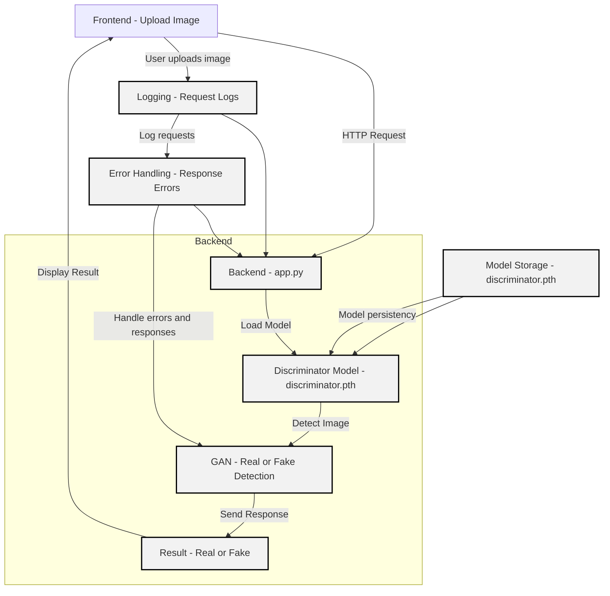

```mermaid
graph TD
    %% Frontend Interaction
    A[Frontend - Upload Image] -->|HTTP Request| B[Backend - app.py]
    
    %% Backend Logic
    subgraph Backend
        B -->|Load Model| C[Discriminator Model - discriminator.pth]
        C -->|Detect Image| D[GAN - Real or Fake Detection]
        D -->|Send Response| E[Result - Real or Fake]
    end

    %% Frontend Output
    E -->|Display Result| A
    
    %% Optional Enhancements
    F[Logging - Request Logs] --> B
    G[Error Handling - Response Errors] --> B
    H[Model Storage - discriminator.pth] --> C

    %% Flow Descriptions
    A -->|User uploads image| F
    F -->|Log requests| G
    G -->|Handle errors and responses| D
    H -->|Model persistency| C

    %% Styling for Clarity
    classDef backendStyle fill:#f2f2f2,stroke:#000,stroke-width:2px;
    class B,C,D,E,F,G,H backendStyle;
    
    class B,C,D,E backendStyle;
    class F,G,H fill:#e6f7ff,stroke:#0066cc,stroke-width:2px;

```    
